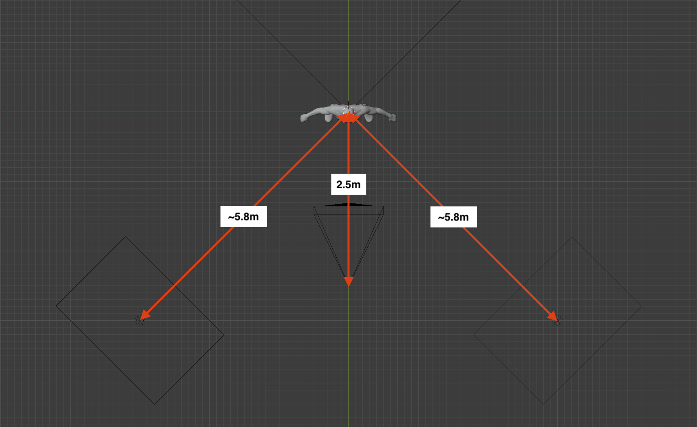
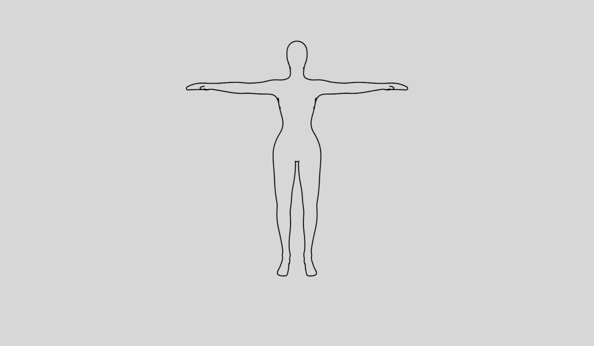

#  **Croqee 3D Asset Library**

This documentation is a tool that will help you getting started with the Croqee 3D Asset Library. It also explains the basics of working with Blender.

  

## **Basics of Blender** ##

The goal of this section is to give a quick introduction to Blender. 

  

### **Shortcuts** ###

>#### Navigation in 3D space ####

>**Right click -** Select  
>**Middle click -** Pan  
>**Mouse wheel -** Zoom   

>#### Manipulation of objects ####
  
>**G -** move tool  
>**R -** rotate tool  
>**S -** scale tool  

>#### Useful actions ####

>**Ctrl/⌘ + Z -** Undo  
>**Ctrl/⌘ + Shift + Z -** Redo   
>**Shift + A -** Add object  
>**Shift + D -** Duplicate object  
>**Ctrl/⌘ + S -** Save project  
>**Spacebar -** Search for function  
>**Tab -** Switch object/edit mode  

 
 

### **Understanding the interface** ###

Blender's interface may seem quite overwhelming at first, but once you understand what each part of it does, it becomes much clearer. To make this easier, you can refer to the graphic below.

 

1. Tools
2. Switch modes
3. Render tab
4. Viewport settings
5. Layers (Collections)
6. Properties selection tab
7. Properties tab

 

## **Technical notes** ##

Croqee's models are being rendered to approximate view of a person sitting in a real art studio. 

### **Camera setup** ###

The current setup corresponds to a person sitting 2,5m away from the model. The eye height is 1,2m above ground. Focal length of the camera is 35mm. Reasons for this particular focal length are explained below.

  

### **Focal length & human vision** ###

  

  

On a 35mm full-frame camera (36mm x 24mm frame size):

* A **10mm** lens has a 121.9° horizontal field of view (FOV), which corresponds to our full range of binocular vision.
  
* A **28mm** lens has a 65.5° FOV, which is a little wider than the area of focus, so it includes some peripheral vision.
  
* A **35mm** lens has a 54.4° FOV, which corresponds to the area of focus for two eyes.
  
* A **50mm** lens has a 39.6° FOV, which corresponds to the monocular vision from a single eye.
  
* A **70mm** lens has a 28.8° FOV which corresponds to the area of detail vision.

  

### Importing models ###

If you need to make a more complex scene, you might want to do it by joining multiple models from different files. This can be done by importing models into your current project. 

 

1. To import .blend object, you have to go to the **File** tab and select the **Append** option.

 

1. Then you'll have to navigate to your .blend file and open it.

 

1. Once you double click on the .blend file, you'll see a list of different folders. The one that you need to open is called **Mesh**. It stores the geometry of your object.

 

1. Last step is to select the file with geometry and click the **Append** button.

After all of this is done, you'll be able to see your new object in the layers panel (5) on the right.

 

### **Rendering the scene** ###

## **Model documentation** ##

The Croqee models can be split into two categories:  
1. Still life models  
2. Anatomical models

Both of these categories require different treatment when setting up a scene. The details are explained below.

 

### **Anatomy models** ###

The purpose of the anatomical models is to replace real life human models doing various poses. Because of this, it is necessary to rig the models. Rigging refers to adding an armature that behaves similar to real skeleton. The riggs used in this model library were created using Blender's **Rigify** add-on. To start posing these models, you'll have to download them from the link below:  
[Download rigged models here](https://drive.google.com/drive/folders/1KPnilKiDZKjVpfdktC_iHgrsbtNJzXsD?usp=sharing)

 

### **Posing the model** ###

Once you open the file, you'll see the model and also the armature. To begin posing it, you'll have to select the armature either by clicking on it directly or finding it between the layers.

After this, you'll need to switch to the **Pose mode**. This will allow you to actually start posing the model. Feel free to play with the armature controls until you get the feel for it. You can do this by choosing one of the controls and using the [manipulation of objects shortcuts](#shortcuts).

 

### **How, when, and why to use different materials** ###

Every model has at least two materials with a very specific uses. 
  
 

You can change the materials using the properties selection tab by clicking on the materials icon (1 - outlined green)

 

* **White** - diffuse color used for main renders. 
  
 

* **Transparent** - transparent shader used to make a tranparent render pass of the model when creating the outlines used for image recognition.

 

### **How to set up the modifiers and how to interact with them** ###

An important part of each of the models is the use of special modifiers. the most common ones are the **Subdivision surface** and **Mirror** modifiers. 

 

### **If there are multiple layers, what is on those layers** ###

 